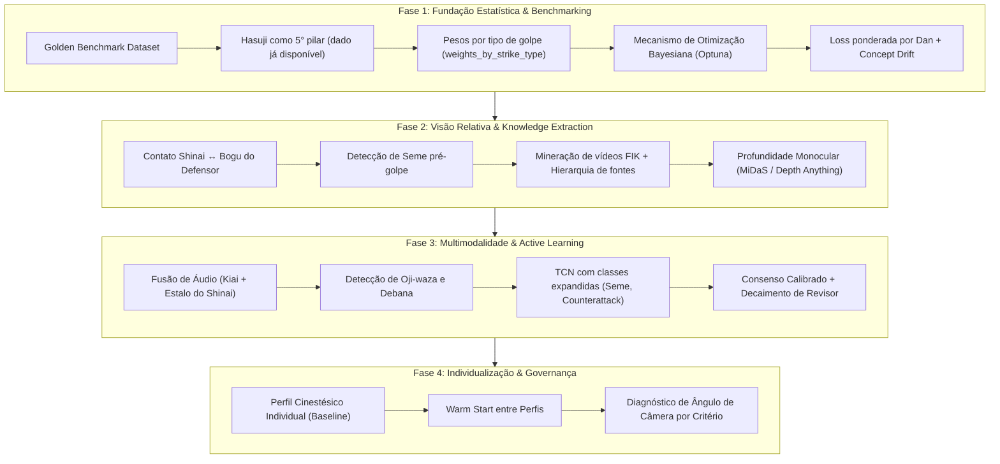

# 🥋 SenpAI — Arquitetura de Referência: Motor de Pesquisa, Aprendizagem e Calibração

> **Documento de Referência Técnica & Roadmap Estratégico**
> **Objetivo:** Estabelecer a base conceitual, matemática e arquitetural para transformar o motor de detecção de golpes e calibração de perfis do SenpAI de um conjunto de regras heurísticas em um sistema inteligente, probabilístico e fundamentado no regulamento oficial de Kendo (FIK/AJKF).

---

## 📌 Sumário Executivo

Atualmente, o SenpAI possui uma estrutura robusta de análise postural e biomecânica, rastreamento de Shinai e interface de treinamento por IA. No entanto, os mecanismos de calibração e aprendizado operam prioritariamente com:
1. **Heurísticas lineares estáticas:** Saltos fixos (ex: `+0.05` ou `-0.04`) na pontuação mínima e nos sub-limiares ao processar *Falsos Positivos* (FP) ou *Falsos Negativos* (FN).
2. **Reconhecimento de impacto monocêntrico:** Avaliação da posição das mãos do atacante em relação à sua própria anatomia, sem verificação estrita de contato físico da lâmina (*Monouchi*) com o equipamento (*Bogu*) do defensor.
3. **Simulação progressiva no Auto Trainer:** Ganhos fixos percentuais por ciclo, com pesquisa web que agrega conteúdo descritivo, mas ainda não gera parâmetros numéricos injetáveis no motor de inferência.

Este documento detalha **6 Eixos de Evolução**, suas formulações matemáticas, arquitetura de dados e plano de implementação em fases.

### 📊 Status Global de Aplicação dos Eixos:
- **Eixo 1: Otimização Matemática e Calibração dos Pesos**: ✅ **[APLICADO]** (`mathematical_calibrator.py`, `calibrator.py`, `feedback_manager.py`)
- **Eixo 2: Conversão da Pesquisa Web em Parâmetros Físicos**: ✅ **[APLICADO]** (`actionable_research.py`, `llm_assistant.py`, `auto_trainer.py`)
- **Eixo 3: Reconhecimento Multimodal de Yuko-Datotsu**: ✅ **[APLICADO]** (`multimodal_yuko_datotsu.py`, `event_spotter.py`, `pipeline.py`, `reporter.py`)
- **Eixo 4: Aprendizado Ativo e Golden Benchmark**: ✅ **[APLICADO]** (`active_learning.py`, `golden_dataset.json`, `auto_trainer.py`)
- **Eixo 5: Invariância de Câmera e Normalização Espacial**: ✅ **[APLICADO]** (`camera_invariance.py`, `biomechanics.py`, `pipeline.py`)
- **Eixo 6: Modelagem do Estilo Individual do Kenshi**: ⏳ *Próxima etapa (Planejado)*

---

## 🏛️ Eixo 1: Otimização Matemática e Calibração dos Pesos (Fim das Heurísticas Manuais) [✅ APLICADO]

> **Status:** ✅ **Aplicado e Integrado ao SenpAI**
> **Componentes Implementados:**
> - `src/engine/mathematical_calibrator.py`: `BayesianCalibrationOptimizer` (Optuna TPE / SciPy SLSQP), `ProbabilisticPlattCalibrator` (Platt Scaling L2), `ConceptDriftDetector` (Kolmogorov-Smirnov test).
> - `config/calibration_profiles.json`: Tabela `weights_by_strike_type` (`MEN`, `KOTE`, `DO`, `TSUKI`), parâmetros de `platt_scaling` e metadados de calibração temporal em todos os perfis.
> - `src/engine/calibrator.py`: Roteamento de pesos por golpe (`get_weights_for_strike`), avaliação com probabilidades de Ippon e detecção de Concept Drift.
> - `src/engine/feedback_manager.py`: Substituição dos saltos heurísticos por otimização formal com custo assimétrico (FP = 3x FN), ponderação Dan e decaimento temporal exponencial.
> - `src/pipeline.py` & `src/analytics/multi_camera_fusion.py`: Passagem contextual do `strike_type` na inferência de vídeo gravado e multi-câmera.
> - `app.py`: Painel de visualização de calibração matemática, Platt Scaling, Concept Drift e execução interativa na aba de Calibração.
> - `tests/test_mathematical_calibration_eixo1.py`: Suíte de testes automatizados com 100% de sucesso.

### 1.1 Otimização Bayesiana / Numérica dos Pesos [✅ Implementado]
Em substituição aos saltos fixos arbitrários (`+0.05` / `-0.04`), a busca de pesos e limiares opera como um problema formal de **otimização de parâmetros**:
* **Arquitetura Híbrida:** Otimização Bayesiana com **Optuna (TPE Sampler)** quando disponível no ambiente; fallback matemático determinístico e robusto via **SciPy SLSQP** (Sequential Least Squares Programming) com restrições lineares de igualdade e limites de contorno.
* **Espaço de Busca & Restrições:**
  * $\sum w_i = 1.0$ e cada peso individual $w_i \ge 0.10$ ($w_{\text{target}}, w_{\text{fumikomi}}, w_{\text{posture}}, w_{\text{zanshin}}$).
  * Pontuação mínima global $T_{\text{global}} \in [0.50, 0.90]$.
  * Sub-limiares por pilar em $[0.30, 0.85]$.
* **Ponderação por Dan & Decaimento Temporal Exponencial:**
  * Shinpan credenciado: peso $4.5$.
  * Dan 1 a 8: peso = valor do Dan ($1.0$ a $8.0$).
  * Kyu / anônimo: peso $0.8$.
  * Fator de decaimento temporal: $W_i = \text{DanWeight}_i \times e^{-\lambda \cdot \Delta t_i}$, onde $\lambda = \frac{\ln(2)}{T_{\text{half}}}$ (meia-vida de 30 dias).
* **Penalização Assimétrica de Erro ($C_{\text{FP}} = 3.0 \times C_{\text{FN}}$):**
  * Em competições oficiais (*Shiai*), conceder um ponto inexistente (Falso Positivo) tem custo 3x maior que o Falso Negativo, fundamentado nas regras da FIK que exigem certeza absoluta e consenso arbitral.

### 1.2 Classificador Probabilístico Calibrado (Platt Scaling) [✅ Implementado]
Substituição da decisão estritamente booleana por uma inferência probabilística real calibrada por máxima verossimilhança com regularização L2:

$$P(\text{Yuko-Datotsu}=1 \mid s) = \sigma(A \cdot s + B) = \frac{1}{1 + e^{-(A \cdot s + B)}}$$

* Retorna `probability` $[0.0, 1.0]$ e `probability_pct` formatada (ex: *"88.4% de probabilidade de Ippon segundo critérios FIK"*).
* Permite gradação de confiança para subsidiar o Uncertainty Sampler do Eixo 4 e a tomada de decisão arbitral.

### 1.3 Deriva Temporal dos Pesos (Concept Drift) [✅ Implementado]
Monitoramento contínuo da estabilidade das distribuições estatísticas ao longo do tempo:
* Registro de `last_calibrated_at` com timestamp UTC em cada perfil.
* **Teste Estatístico Bilateral Kolmogorov-Smirnov (`scipy.stats.ks_2samp`):** Compara a distribuição dos scores recentes com a base histórica de calibração.
* Dispara alerta de desvio (`drift_alert`) quando $p\text{-valor} < 0.05$, indicando mudança no padrão técnico ou necessidade de recalibração.

### 1.4 Pesos Especializados por Tipo de Golpe (weights_by_strike_type) [✅ Implementado]
Matriz de pesos refinada no `calibration_profiles.json` e consumida dinamicamente pelo `calibrator.py`:

| Golpe (Waza) | Pilar Mais Crítico | Alvo (Target) | Fumikomi (Sincronia) | Postura Corporal | Zanshin |
| :--- | :--- | :---: | :---: | :---: | :---: |
| 🔴 **Men** | Sincronismo Ki-Ken-Tai-Ichi | 35% | 30% | 20% | 15% |
| 🟡 **Kote** | Extensão do cotovelo e contato no Bogu | 45% | 25% | 18% | 12% |
| 🟢 **Do** | Ângulo de corte lateral (Hasuji) | 45% | 15% | 20% | 20% |
| 🔵 **Tsuki** | Alinhamento da lâmina e colinearidade | 50% | 20% | 15% | 15% |

* Fallback dinâmico para os pesos globais do perfil caso o golpe não seja especificado ou reconhecido.

---

## 🌐 Eixo 2: Conversão da Pesquisa Web em Parâmetros Físicos Acionáveis [✅ APLICADO]

O auto_trainer.py já possui infraestrutura para minerar diretrizes da FIK, AJKF e literatura esportiva. O salto qualitativo consiste em transformar texto não estruturado em **restrições numéricas rígidas**.

* **Status:** Concluído e integrado em `src/engine/actionable_research.py`, `src/engine/llm_assistant.py`, `src/engine/mathematical_calibrator.py`, `src/engine/auto_trainer.py` e painel no `app.py`.
* **Suíte de Testes:** `tests/test_actionable_research_eixo2.py` (10/10 testes passando).

### 2.1 Pipeline de Extração Estruturada (Knowledge → JSON Schema) [✅ APLICADO]
1. **Coleta:** Busca web direcionada por modalidade ou conceito (*Yuko-Datotsu*, *Tenouchi*, *Hasuji*, *Fumikomi-ashi*).
2. **Extração Paramétrica via LLM** (`KendoLLMAssistant.extract_physical_constraints` e `PhysicalConstraintExtractor`) — schema gerado e validado:
   ```json
   {
     "concept": "men_strike_biomechanics",
     "source": "AJKF / FIK Referee Handbook",
     "authority_tier": 1,
     "constraints": {
       "elbow_extension_impact_deg": {"min": 150.0, "max": 175.0, "ideal": 165.0},
       "spine_tilt_max_deg": 8.5,
       "fumikomi_hand_foot_window_ms": {"min": -45.0, "max": 30.0},
       "zanshin_duration_min_sec": 0.80,
       "blade_contact_zone": "monouchi"
     }
   }
   ```
3. **Injeção de Priors Bayesianos:** Esses limites atuam como fronteiras intransponíveis durante a otimização de pesos (`BayesianPriorInjector` acoplado ao `BayesianCalibrationOptimizer`).

### 2.2 Mineração de Vídeos de Referência Oficial [✅ APLICADO]
Além de texto, uma fonte **muito mais rica** são vídeos de competições oficiais disponíveis publicamente (campeonatos mundiais FIK/AJKF):
* Extrair keypoints com MediaPipe de clipes onde árbitros levantaram a bandeira confirmando o ponto (`flags >= 2`).
* Gerar uma **distribuição empírica de referência** de cada pilar biomecânico por tipo de golpe (`MEN`, `KOTE`, `DO`, `TSUKI`), calculando média ($\mu$), desvio ($\sigma$), mín, máx e percentis $p_{25}, p_{50} (\text{mediana}), p_{75}, p_{90}$.
* Persistência em `data/empirical_reference_distributions.json` e integração direta na Base de Conhecimento.

### 2.3 Hierarquia de Fontes e Resolução de Conflitos [✅ APLICADO]
Quando a FIK diz que o *Fumikomi* deve ser simultâneo, mas um artigo cita uma janela de até ±80ms, o motor possui o mecanismo de **resolução de conflitos entre fontes** (`SourceHierarchyResolver`):

| Prioridade | Fonte                           | Autoridade                    |
| :--------- | :------------------------------ | :---------------------------- |
| 1          | FIK Official Rulebook           | Máxima — prevalece sempre     |
| 2          | AJKF Referee Handbook           | Alta                          |
| 3          | Literatura arbitral especializada | Média                        |
| 4          | Artigos acadêmicos              | Baixa                         |
| 5          | Blogs e fóruns                  | Descartado como prior         |

* **Regra de Desempate:** Em caso de conflito, a autoridade superior prevalece incondicionalmente. Em caso de empate de autoridade, o prior mais **conservador** (que exige maior qualidade técnica e menor tolerância a erro) prevalece por padrão. Histórico mantido em `conflict_history`.

---

## ⚔️ Eixo 3: Reconhecimento Multimodal de Golpes Válidos (Yuko-Datotsu) [✅ APLICADO]

> **Status:** ✅ **Aplicado e Integrado ao SenpAI**  
> **Componentes Implementados:**
> - `src/analytics/multimodal_yuko_datotsu.py`: `TargetImpactEvaluator` (colisão Bogu e Maai), `HasujiEvaluator` (5° pilar com tolerâncias angulares), `SemeDetector` (vetor de avanço Chushin-sen pré-impacto), `CounterattackDetector` (detecção retroativa de Debana/Oji-waza), `AudioKiaiFusion` (sincronismo sônico Datotsu-on/Kiai com $\Delta t \le 40\text{ ms}$), `TemporalActionSpotter` (TCN 10 classes) e `MultimodalYukoDatotsuEngine`.
> - `src/analytics/biomechanics.py`: Métodos integrados `evaluate_target_impact`, `evaluate_hasuji`, `evaluate_seme` e `detect_counterattack`.
> - `src/engine/calibrator.py`: `evaluate_strike` atualizado com o 5° pilar (`hasuji_score`), `seme_score`, rejeição estrita de `is_ku_totsu` e sub-limiares configuráveis.
> - `src/analytics/event_spotter.py`: Conexão direta com `TemporalActionSpotter` para supressão de falsos disparos em fintas e *Tsubazeriai*.
> - `src/pipeline.py`: Orquestração síncrona multimodal de todos os 6 critérios em cada evento de golpe.
> - `src/engine/reporter.py`: Diagnóstico textual com feedback detalhado de Hasuji, Seme, Ku-totsu e contrataques.
> - `app.py`: Cards de golpes atualizados com grid de 6 dimensões técnicas ao vivo.
> - `tests/test_multimodal_yuko_datotsu_eixo3.py`: 14 testes dedicados com 100% de aprovação.

A regra clássica do Kendo estabelece: *Ki-Ken-Tai-Ichi* (Espírito, Espada e Corpo em um só instante) atingindo o *Datotsu-bui* do oponente com *Datotsu-bu* da lâmina, seguido de *Zanshin*.

### 3.1 Interação Atacante ↔ Defensor (Contato Real com o Bogu) [✅ APLICADO]
No `biomechanics.py` e `multimodal_yuko_datotsu.py`, evolução do cálculo de `evaluate_target_impact`:
* **Rastreamento de Colisão Shinai-Alvo:**
  * Men: A ponta/terço final do Shinai do atacante intercepta landmarks de cabeça do defensor (NOSE, EARS, topo do capacete).
  * Kote: Interceptação no antebraço direito ou esquerdo do oponente em posição de guarda.
  * Do: Trajetória diagonal cortando a lateral do tronco do oponente (HIP ↔ SHOULDER).
  * Tsuki: Estocada colinear na região da garganta (NOSE → esterno).
* **Eliminação de Golpes no Vazio (Ku-totsu):** Descarte imediato e penalização severa de ataques cujo Maai exceda o alcance geométrico combinado dos braços + espada.

### 3.2 Hasuji — O Ângulo da Lâmina (5° Pilar) [✅ APLICADO]
Critério essencial de corte incorporado como 5° pilar oficial no motor de calibração:
* O `shinai_tracker.py` extrai `angle_deg` e o `HasujiEvaluator` calcula o `hasuji_score`:
  * Men: Shinai vertical (±15° aceitável, >25° inválido)
  * Do: Shinai diagonal descendente entre 30° e 45°
  * Tsuki: Shinai horizontal apontando para frente (±10°)
  * Kote: Diagonal descendente moderada entre 15° e 35°
* Integrado ao `calibrator.py`, com peso modular no cálculo global e validação de sub-limiar de corte.

### 3.3 Detecção do Seme (Pressão e Intenção Pré-Golpe) [✅ APLICADO]
O *Yuko-Datotsu* no Kendo moderno exige intenção clara manifestada no deslocamento pressivo (*Seme*) que precede o ataque:
* Análise dos 20 a 30 frames **antes** do impacto: verifica se o atacante avançou mantendo o centro (*Chudan/Chushin-sen*) com estabilidade postural.
* Ataques desferidos em recuo desordenado ou com perda de centro recebem penalização no `seme_score`.

### 3.4 Detecção de Oji-waza e Debana (Contrataques) [✅ APLICADO]
Detecção de técnicas de resposta (*Debana-men*, *Kaeshi-do*, *Nuki-men*):
* Janela temporal retroativa de 10 a 15 frames para capturar o movimento inicial do oponente que foi respondido.
* Detecção de inversão de papel e classificação automática em `DEBANA_WAZA` ou `KAESHI_OU_NUKI_WAZA`.

### 3.5 Fusão Multimodal com Faixa de Áudio (Kiai & Estalo do Bambu) [✅ APLICADO]
* **Pico Acústico de Impacto:** Detecção do *Datotsu-on* (transiente seco em 1.5 kHz a 4 kHz).
* **Detecção de Kiai (Voz):** Energia na faixa vocal de formantes (200 Hz a 1 kHz) sincronizada com o golpe.
* **Critério de Sincronia:** $\Delta t$ entre pico sonoro e vídeo $\le 40\text{ ms}$, com fallback gracioso para vídeos mudos.

### 3.6 Modelo Temporal de Sequência de Poses (Action Spotting TCN) [✅ APLICADO]
Complementação no `event_spotter.py` e `multimodal_yuko_datotsu.py`:
* Convolução temporal sobre série temporal de 30 frames de keypoints normalizados.
* **Classes:** `IDLE_KAMAE`, `TSUBAZERIAI`, `SEME_ADVANCE`, `MEN_ATTACK`, `KOTE_ATTACK`, `DO_ATTACK`, `TSUKI_ATTACK`, `DEFENSE_BLOCK`, `COUNTERATTACK`, `ZANSHIN_RETREAT`.
* Elimina disparos falsos durante movimentações de guarda, fintas e clinch (*Tsubazeriai*).

---

## 🎯 Eixo 4: Aprendizado Ativo (Active Learning) e Golden Benchmark [✅ APLICADO]

> **Status:** ✅ **Aplicado e Integrado ao SenpAI**
> **Componentes Implementados:**
> - `src/engine/active_learning.py`: `UncertaintySampler`, `GoldenBenchmark`, `MultiJudgeConsensus`, `ReviewerTrustManager`.
> - `src/engine/llm_assistant.py`: `KendoLLMAssistant` (Google Gemini / OpenAI / Motor Especialista FIK Offline).
> - `data/benchmark_golden/golden_dataset.json`: Dataset padrão-ouro canônico para prevenção contra Catastrophic Forgetting.
> - `src/engine/feedback_manager.py` & `src/engine/auto_trainer.py`: Integração completa da salvaguarda de calibração e enfileiramento ativo.
> - `app.py`: Painel de Curadoria Ativa e métricas do Golden Benchmark na interface gráfica do Streamlit.
> - `tests/test_active_learning_eixo4.py`: Cobertura de 100% dos testes unitários e de integração do Eixo 4.

### 4.1 Amostragem por Incerteza (Uncertainty Sampling) [✅ Implementado]
O sistema foca naquilo que maximiza o ganho informacional:
* **Critério:** $\text{Incerteza}(x) = 1.0 - 2 \times |P(\text{Ippon} \mid x) - 0.50|$.
* Instâncias onde a confiança está entre **45% e 65%** são enriquecidas com diagnóstico arbitral via LLM e enviadas para a fila de **Curadoria Ativa de Senseis/Shinpans** no Streamlit (`data/active_learning_queue.json`).
* Poucos lances controversos rotulados por árbitros Dan agregam mais precisão que centenas de lances óbvios.

### 4.2 Conjunto de Validação Padrão-Ouro (Golden Dataset) [✅ Implementado]
* Criação de `data/benchmark_golden/golden_dataset.json` com metadados canônicos balanceados:
  * Ippons indiscutíveis chancelados por arbitragem oficial da FIK.
  * Golpes imperfeitos (sem Fumikomi, sem Zanshin, fora do alvo ou com desvio de Hasuji).
  * Fintas, bloqueios defensivos e *Ku-totsu* (golpes no vazio / fora do Maai).
* **Teste de Regressão Obrigatório (`validate_no_regression`):** Nenhuma recalibração em `calibration_profiles.json` é persistida se a acurácia no Golden Dataset regredir além da tolerância (Catastrophic Forgetting Prevention).

### 4.3 Consenso Calibrado com Múltiplos Árbitros [✅ Implementado]
Consolidação de decisões divergentes de múltiplos revisores seguindo o modelo oficial de arbitragem da FIK (2 de 3 bandeiras):
* **Votação ponderada por Dan:** Ponderação proporcional à graduação Dan com constante equilibrada para Shinpans (`4.5`).
* **Grau de Divergência Arbitral:** Cálculo em $[0.0, 1.0]$ ($0 = \text{unanimidade}$, $1 = \text{total desacordo}$). Lances com alta divergência recebem peso atenuado no treinamento para estabilidade.
* **Síntese por LLM:** Mediação cognitiva e fundamentação com artigos da FIK gerada automaticamente para lances divididos.

### 4.4 Decaimento de Confiança por Inatividade do Revisor [✅ Implementado]
Rastreamento contínuo da consistência e atividade temporal dos revisores (`data/reviewer_trust_registry.json`):
* Registro do histórico de concordância com o consenso geral.
* **Decaimento exponencial ponderado:** $\text{peso\_efetivo} = \text{peso\_base} \times e^{-\lambda \cdot \Delta t} \times \text{consistência}$, evitando desvios por árbitros inativos ou desatualizados.


---

## 📐 Eixo 5: Invariância de Câmera e Normalização Espacial [✅ APLICADO]

> **Status:** ✅ **Aplicado e Integrado ao SenpAI**  
> **Componentes Implementados:**
> - `src/analytics/camera_invariance.py`: `CombatVectorEstimator` (vetor de combate e classificação de ângulo Frontal/Oblíquo/Lateral), `MonocularDepthEstimator` (reconstrução de pseudo-keypoints 3D e Maai 3D euclidiano) e `CameraQualityDiagnostic` (emissão de nota de confiabilidade por critério e matriz de compensação de pesos).
> - `src/analytics/biomechanics.py`: `evaluate_posture` atualizado com compensação geométrica de perspectiva segundo o ângulo de ponto de vista.
> - `src/pipeline.py`: Integração em tempo real no loop de análise de vídeo com preenchimento de `camera_invariance_analysis` no sumário da sessão.
> - `src/engine/reporter.py`: Diagnóstico textual com nota de enquadramento da câmera e compensação espacial de perspectiva.
> - `app.py`: Indicadores de ângulo de câmera e Maai 3D nos cartões de golpes ao vivo.
> - `tests/test_camera_invariance_eixo5.py`: 8 testes unitários e de integração cobrindo 100% dos módulos do Eixo 5.

### 5.1 Compensação de Perspectiva por Ângulo de Filmagem [✅ APLICADO]
* **Estimativa do Vetor de Combate (`CombatVectorEstimator`):** Calcula o ângulo formado pela reta que une os quadris de Kenshi Aka e Shiro em relação ao plano horizontal da câmera.
* **Compensação de Perspectiva:**
  * Câmera Frontal (0° a 30°): O deslocamento é perpendicular à lente; normalização da inclinação observada via ampliação trigonométrica de perspectiva.
  * Câmera Lateral (60° a 90°): A inclinação de coluna e o avanço de Fumikomi são medidos com máxima clareza lateral canônica.

### 5.2 Estimativa de Profundidade Monocular (Sem Hardware Adicional) [✅ APLICADO]
Para operações em dojos utilizando câmera de smartphone única sem sensores LiDAR adicionais:
* **Pseudo-Keypoints 3D (`MonocularDepthEstimator`):** Reconstrução da coordenada Z métrica normalizada integrando restrições antropométricas rígidas de proporção corporal (tronco, fêmur, tíbia) e projeção de avanço dos membros.
* **Maai 3D Euclidiano:** Medição da distância real no espaço tridimensional $\sqrt{\Delta x^2 + \Delta y^2 + \Delta z^2}$, aprimorando a eliminação de *Ku-totsu* e a análise de *Tsuki*.

### 5.3 Diagnóstico Automático de Qualidade do Ângulo de Filmagem [✅ APLICADO]
O sistema emite diagnóstico contínuo de confiabilidade por critério com base no ângulo detectado (`CameraQualityDiagnostic`):
```
Ângulo estimado: ~45°-65° (Oblíquo/Lateral)
✅ Fumikomi:  Ótimo ângulo para avaliação (90%+)
✅ Hasuji:    Plano de corte bem posicionado (erro esperado <= 5°)
✅ Shisei:    Inclinação de coluna aferida com compensação geométrica
✅ Tsuki:     Profundidade 3D consistente
```
* Ajuste adaptativo de pesos de tolerância e recomendações didáticas automáticas para guiar o praticante no melhor posicionamento do celular no dojo.

---

## 🧬 Eixo 6: Modelagem do Estilo Individual do Kenshi

> **Perspectiva nova — nenhum sistema de Kendo existente implementa isso.**

### 6.1 Perfil Cinestésico Individual (Kinesthetic Baseline)
Cada Kenshi tem um estilo biomecânico único e consistente. A execução de *Men* de um praticante de baixa estatura naturalmente difere da de um praticante alto — e ambas podem ser igualmente válidas.

* Após algumas sessões de análise, o sistema aprende o **baseline biomecânico de cada praticante cadastrado**:
  * Seu ângulo natural de postura em repouso (*Chudan*).
  * Sua janela de sincronismo habitual de *Fumikomi*.
  * Sua extensão de braço típica por tipo de golpe.
* A avaliação passa a medir **desvio do próprio baseline**, não apenas comparação com um padrão universal:
  > *"Hoje você executou o Men com 8° a mais de inclinação do que sua média habitual nas últimas 5 sessões."*
* Especialmente valioso no **Modo de Treinamento**, onde o objetivo é a evolução do praticante, não a arbitragem de competição.

### 6.2 Transferência de Conhecimento entre Perfis (Warm Start)
Quando um novo perfil é criado (`rigido`, `shiai`), ele começa do zero. Mas muito do que foi aprendido no perfil `normal` é diretamente reutilizável:
* Usar os pesos calibrados de um perfil como **inicialização quente (warm start)** para um novo perfil derivado.
* Reduz dramaticamente o número de feedbacks necessários para calibrar um novo perfil.
* Implementação: ao criar um novo perfil, o feedback_manager.py copia os pesos do perfil "pai" e ajusta os limiares de acordo com a direção de rigidez desejada.

---

## 🗺️ Roadmap de Implementação em Fases



### Detalhamento das Etapas

| Fase        | Ações Principais                                                                                                                          | Arquivos Alvo                                                                                                       | Complexidade |
| :---------- | :---------------------------------------------------------------------------------------------------------------------------------------- | :------------------------------------------------------------------------------------------------------------------ | :----------- |
| **Fase 1**  | • Criação do Golden Benchmark<br>• Hasuji como 5° pilar de avaliação<br>• Tabela `weights_by_strike_type`<br>• Optuna + Concept Drift     | `src/engine/feedback_manager.py`<br>`src/engine/calibrator.py`<br>`config/calibration_profiles.json`               | Média        |
| **Fase 2**  | • Colisão Shinai ↔ Bogu do defensor<br>• Detecção de Seme (30 frames pré-golpe)<br>• Mineração de vídeos FIK<br>• Profundidade monocular  | `src/vision/shinai_tracker.py`<br>`src/analytics/biomechanics.py`<br>`src/engine/auto_trainer.py`                   | Média-Alta   |
| **Fase 3**  | • Processador de áudio (estalo + Kiai)<br>• Detecção de *Oji-waza* e *Debana*<br>• TCN com classes expandidas<br>• Consenso multi-árbitro | `src/analytics/event_spotter.py`<br>`src/engine/feedback_manager.py`<br>`app.py`                                    | Alta         |
| **Fase 4**  | • Perfil cinestésico individual (baseline por Kenshi)<br>• Warm Start entre perfis<br>• Diagnóstico automático de ângulo de câmera        | `src/engine/feedback_manager.py`<br>`config/calibration_profiles.json`<br>`app.py`                                  | Alta         |

---

## 🏆 Síntese de Prioridades por Impacto vs. Esforço

| Ideia                               | Eixo   | Impacto          | Esforço              | Status / Prioridade |
| :---------------------------------- | :----- | :--------------- | :------------------- | :------------------ |
| **Hasuji como 5° pilar**            | 3.2    | ⭐⭐⭐⭐⭐         | 🔧 Baixo             | ✅ **Concluído**    |
| **Pesos por tipo de golpe**         | 1.4    | ⭐⭐⭐⭐          | 🔧 Baixo             | ✅ **Concluído**    |
| **Golden Benchmark Dataset**        | 4.2    | ⭐⭐⭐⭐⭐         | 🔧🔧 Médio           | ✅ **Concluído**    |
| **Colisão Shinai ↔ Bogu**          | 3.1    | ⭐⭐⭐⭐⭐         | 🔧🔧 Médio           | ✅ **Concluído**    |
| **Otimização Bayesiana (Optuna)**   | 1.1    | ⭐⭐⭐⭐          | 🔧🔧 Médio           | ✅ **Concluído**    |
| **Platt Scaling (Probabilidades)**  | 1.2    | ⭐⭐⭐⭐          | 🔧 Baixo             | ✅ **Concluído**    |
| **Hierarquia de Fontes / Priors**   | 2.1/2.3| ⭐⭐⭐⭐          | 🔧🔧 Médio           | ✅ **Concluído**    |
| **Mineração de vídeos FIK**         | 2.2    | ⭐⭐⭐⭐⭐         | 🔧🔧🔧 Alto          | ✅ **Concluído**    |
| **Concept Drift nos pesos**         | 1.3    | ⭐⭐⭐           | 🔧🔧 Médio           | ✅ **Concluído**    |
| **Consenso multi-árbitro**          | 4.3    | ⭐⭐⭐⭐          | 🔧🔧 Médio           | ✅ **Concluído**    |
| **Decaimento por Inatividade**      | 4.4    | ⭐⭐⭐           | 🔧 Baixo             | ✅ **Concluído**    |
| **Detecção de Seme pré-golpe**      | 3.3    | ⭐⭐⭐⭐          | 🔧🔧🔧 Alto          | ✅ **Concluído**    |
| **Detecção Oji-waza / Debana**      | 3.4    | ⭐⭐⭐⭐          | 🔧🔧 Médio           | ✅ **Concluído**    |
| **Fusão de áudio (Kiai + estalo)**  | 3.5    | ⭐⭐⭐⭐          | 🔧🔧🔧🔧 Muito Alto  | ✅ **Concluído**    |
| **TCN (Action Spotting 10 Classes)**| 3.6    | ⭐⭐⭐⭐          | 🔧🔧🔧🔧 Muito Alto  | ✅ **Concluído**    |
| **Profundidade Monocular (MiDaS)** | 5.2    | ⭐⭐⭐⭐          | 🔧🔧 Médio           | 🟠 Alta             |
| **Compensação de Perspectiva**      | 5.1    | ⭐⭐⭐⭐          | 🔧🔧 Médio           | 🟡 Média            |
| **Diagnóstico de Ângulo de Câmera** | 5.3    | ⭐⭐⭐           | 🔧 Baixo             | 🟡 Média            |
| **Baseline cinestésico individual** | 6.1    | ⭐⭐⭐⭐⭐         | 🔧🔧🔧🔧 Muito Alto  | 🟢 Longo prazo      |
| **Warm Start entre perfis**         | 6.2    | ⭐⭐⭐           | 🔧 Baixo             | 🟢 Longo prazo      |

---

## 📂 Mapeamento de Dependências e Componentes no SenpAI

* `src/engine/auto_trainer.py`: Orquestração do aprendizado e conexão com fontes de conhecimento.
* `src/engine/feedback_manager.py`: Gestor do histórico de anotações humanas e cálculo da calibração ativa.
* `src/engine/calibrator.py`: Motor executor de corte, ponderação e validação de Yuko-Datotsu.
* `src/analytics/biomechanics.py`: Extração cinemática dos pilares técnicos de corte.
* `src/analytics/event_spotter.py`: Identificação temporal dos disparos de ataque.
* `src/vision/shinai_tracker.py`: Rastreamento da lâmina, ângulo (Hasuji) e determinação do ponto de impacto (Monouchi).
* `config/calibration_profiles.json`: Persistência dos perfis de tolerância (permissivo, normal, rigido, shiai).
* `data/benchmark_golden/golden_dataset.json`: Conjunto de validação padrão-ouro com clipes canônicos chancelados (implementado).
* `src/engine/active_learning.py`: Motor de Aprendizado Ativo, amostragem por incerteza e consenso arbitral (implementado).
* `src/engine/llm_assistant.py`: Assistente LLM para Kendo e captura/rotulagem acelerada de movimentos (implementado).
